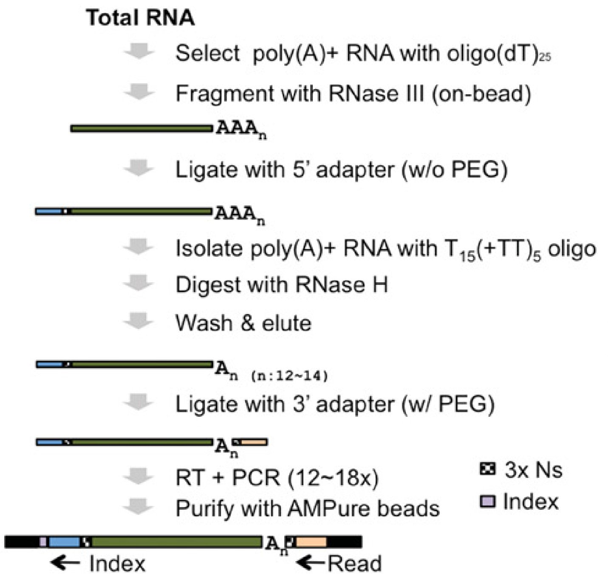
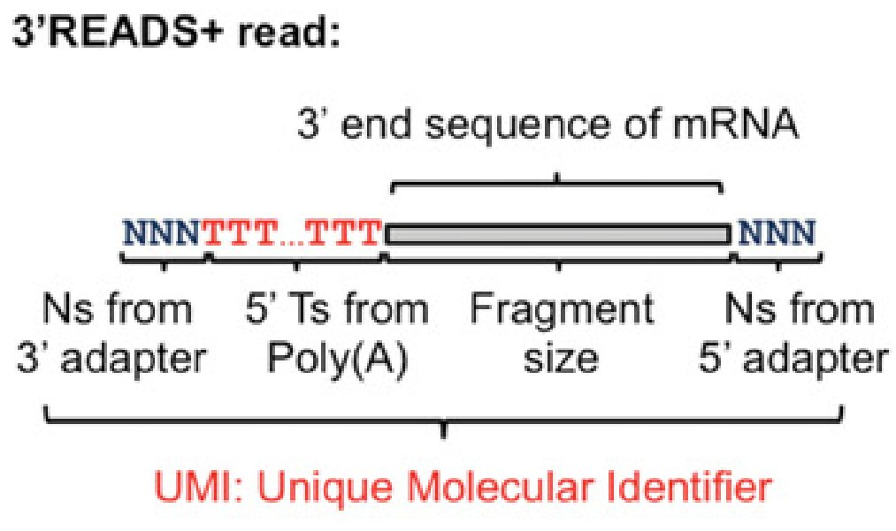

# 3-prime-READS-plus
## Pipeline for analyzing 3' end RNA-seq (3'READS+) data 

About 70% of mRNA genes in eukaryotes contain multiple cleavage and polyadenylation sites (PAS), resulting in alternative cleavage and polyadenylation (APA) isoforms with different coding sequences and/or variable 3′ untranslated regions (3′UTRs). [3'READS+](https://www.ncbi.nlm.nih.gov/pmc/articles/PMC5029459/) is a 3' end RNA-seq protocol for accurate identification of PAS in the genome, even in A-rich regions:

  

Steming from incomplete digestion of the poly(A) tail and absent from the genome, the T-streches at the 5' end of the reads can be used to identify cleavage and polyadenylation sites in the genome:

  

However, long T-streches can also mislead alignment of the reads to the genome. In addition, due to micro-heterogeneity, the mapped reads that are close to each other in the genome need to be clustered into cleavage and polyadenylation (pA) sites.

To solve the above issues, [phase 1](https://github.com/DinghaiZ/3-prime-READS-plus/blob/master/projects/project_1/scripts/experiment_1/Phase-1.ipynb) of this pipeline will trim 5' T-streches while recording T-strech length, map (using [STAR](https://github.com/alexdobin/STAR)) cleaned reads to the genome, and use the recorded T-strech length and genomic alignment result to identify PASS (PolyA Site Supporting) reads, which are defined as reads containing >= 2 extra Ts originated from the poly(A) tail but not from the genome. Each PASS read comes from a cleavage and polyadenylation site (CPS) in the genome. PASS reads within a 24-nt window are then clustered to define a pA site (PAS). The numbers of PASS reads mapped to genome-wide CPS and PAS in different input sample are then used for further analysis. 

## Quick Start

**[Phase 1](https://github.com/DinghaiZ/3-prime-READS-plus/blob/master/projects/project_1/scripts/experiment_1/Phase-1.ipynb) Read QC, generate PASS read count matrix,  and visualize PASS and nonPASS reads in UCSC genome browser.** For every new experiment, you need to create the _project_name/scripts/experiment_name_ folder and paste a copy of Phase-1.ipnb and sample_description.csv there. Then you can edit the two files to begin analysis specific for the experiment.

**Phase 2**. pA site annotation (Coming soon)

**Phase 3**. APA (alternative polyadenylation) and DE (differential gene expression) analysis (Coming soon)

**Phase 4**. Automatic qPCR primer design for validation of APA (Coming soon)  

**Phase 5**. Building machine learning or deep learning models (Coming soon)

