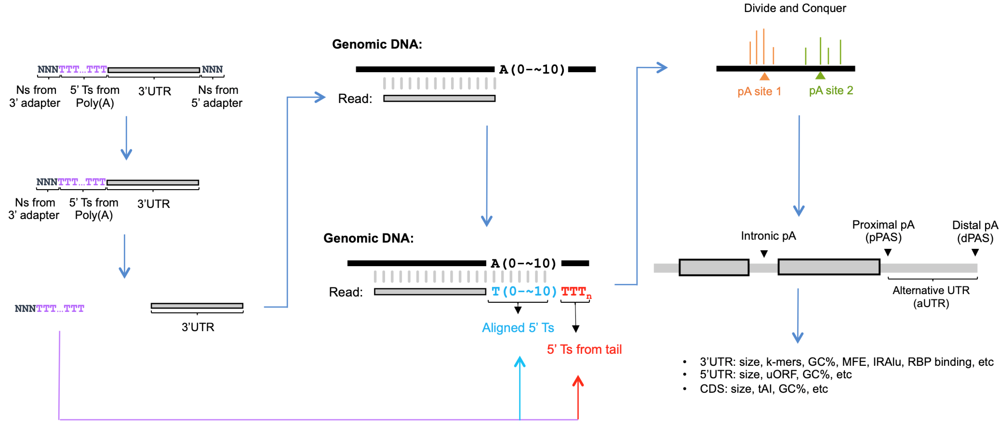

# 3-prime-READS-plus
## A Parallel Computation Pipeline for Analyzing 3' End RNA-seq (3'READS+) Data 

About 70% of mRNA genes in eukaryotes contain multiple cleavage and polyadenylation sites (PAS), resulting in alternative cleavage and polyadenylation (APA) isoforms with different coding sequences and/or variable 3′ untranslated regions (3′UTRs). [3'READS+](https://www.ncbi.nlm.nih.gov/pmc/articles/PMC5029459/) is a 3' end RNA-seq protocol developed in Dr. Bin Tian's lab at Rutgers University for accurate identification of PAS in the genome, even in A-rich regions:

  

Steming from incomplete digestion of the poly(A) tail by RNaseH, the T-streches at the 5' end of the reads can be used to identify cleavage and polyadenylation sites in the genome, because these T-streches cannot be aligned with the genomic sequence:

  

However, long T-streches can also mislead alignment of the reads to the genome. In addition, due to micro-heterogeneity, the mapped reads that are close to each other in the genome need to be clustered into cleavage and polyadenylation (pA) sites.

To solve the above issues, this pipeline will trim 5' T-streches while recording T-strech length, map cleaned reads to the genome, and use the recorded T-strech length and genomic alignment result to identify PASS (PolyA Site Supporting) reads, which are defined as reads containing >= 2 extra Ts originated from the poly(A) tail but not from the genome. Each PASS read comes from a cleavage and polyadenylation site (CPS) in the genome. Due to microheterogeneity during cleavage and polyadenylation, the CPSs tend to form clusters in a small window in the genome. Therefore PASS reads within a 24-nt window are clustered to define a pA site (PAS). The numbers of PASS reads mapped to genome-wide CPS and PAS in different input sample are then used for further analysis: 

  

**The pipeline has the following three parts:**

**[Part 1. From fastq files to pA sites](https://github.com/DinghaiZ/3-prime-READS-plus/blob/master/projects/project_1/experiment_1/notebooks/Part-1.ipynb)** (Python kernel) 
1. Register analysis configurations for specific project/experiment
2. Read sample annotation file
3. Search, download, and merge fastq files 
4. FASTQ QC and calculate length of random nucleotides in 3' ligation adapter
5. Trim 3' adapter
6. Trim 5' Ts while recording information about the trimmed sequences 
7. Map the trimmed reads to the genome 
8. Identify PASS reads and unique PASS reads using recorded information from the 5'T trimming step 
9. Cluster neighboring PASS reads in the genome to define poly(A) sites 
10. Generate summary statistics of read numbers 
11. Generate summary statistics of 5' T-stretch lengths in both PASS and nonPASS reads 
12. Create genome browser tracks for visualizing both PASS reads 

**[Part 2. pA site annotation, feature extraction, and calculation of experiment outcome](https://github.com/DinghaiZ/3-prime-READS-plus/blob/master/projects/project_1/experiment_1/notebooks/Part-2.ipynb)** (R kernel) 
1. Register settings for this analysis. One experiment can be analysed with different settings (parameters). The results for each setting will be saved in different folders under the *result_dir* directory. 
2. Extend annotated 3'UTR regions to allow identification of new pA sites in previously poorly annotated 3'UTRs. 
3. Assign pA clusters identified in Part 1 to genomic features such as extended 3'UTRs, introns, CDSs, and 5'UTRs.
4. Resolve pA sites mapped to multiple genes.
5. Map intergenic and intronic pA sites to Non-Coding RNAs (ncRNAs).
6. Map remaining intergenic pA sites to Upstream Antisense RNAs (uaRNAs).
7. Plot the fractions of pA sites and PASS reads mapped to the mitochondria genome.
8. Resolve pA sites mapped to multiple genomic features of alternatively spliced gene.
9. Plot distribution of pA sites and PASS reads in different genomic features of each sample.
10. Plot nucleotide profile near pA sites mapped to different genomic regions.
11. Calculate optimal Transcript Starting Sites (TSSs).
12. Calculate CDS, intronic, 5'UTR, 3'UTR, and ncRNA features (such as size, GC content, and uORF) and check their relationships.
13. Identify subtypes of pA sites.
14. Identify poly(A) signal (PAS).
15. Check if different subtypes of pA sites tend to use different poly(A) signal (PAS).
16. Get symbols and Entrez gene ids.
17. Calculate gene expression-related features, such as pA site level RPM, gene level RPM, and pA site usage.
18. Filter out lowly expressed 3'UTR pAs.
19. Number of pA sites per gene and its relationship with 3'UTR and CDS GC%.
20. Minimum Folding Energy (MFE) of exonic 3'UTR sequences.
21. Features of mRNAs encoding differentially localized proteins.
22. Calculate RBP binding scores using RNAcompete and SELEX data downloaded from ATtRACT.
23. Annotate Alu and IRAlu elements (human samples only).
24. Use DESeq2 to transform data and calcualte pA site fold change (FC).

**Part 3. Use machine learning to identify features that may significantly influence experiment outcome** (Coming soon.) 
1. Random forest models
2. Deep neurual networks

## What is in each folder?

**[modules](https://github.com/DinghaiZ/3-prime-READS-plus/tree/master/modules)**: Definitions of functions and classes used in the pipeline.

**[notebooks](https://github.com/DinghaiZ/3-prime-READS-plus/tree/master/notebooks)**: Template Jupyter notebooks that should be copied into each */projects/project_name/experiment_name* folder, edited, and run for each experiment under different projects.

**[projects](https://github.com/DinghaiZ/3-prime-READS-plus/tree/master/projects)**: A tree-like directory containing one *project_name/experiment_name* folder for each experiment under different projects. Within each *project_name/experiment_name* folder, there are three subfolders: *notebooks* (code for project and experiment-specific analyses), *data* (data for project and experiment-specific analysis), and *results* (analysis results). The *data* and *results* subfolders will be automatically created by the notebooks. 

**tests**: Code for testing the pipeline during development. Not needed for running the notebooks.

**images**: Images displayed in the README on github. Not needed for running the notebooks.

## Quick Start

**Before each analysis, please do the following:**
1. git clone the repo to your system.
2. Copy the *notebooks* folder into a *projects/project_name/experiment_name* folder. You can name the projects and experiments the way you want.
3. Open the notebooks with Jupyter Lab and edit the analysis configuration sections (at the beginning) of the notebooks for project and experiment-specific analysis.
4. Make sure that 3rd party softwares have been installed on your system and are in your path.
5. Run the notebooks and have fun!

